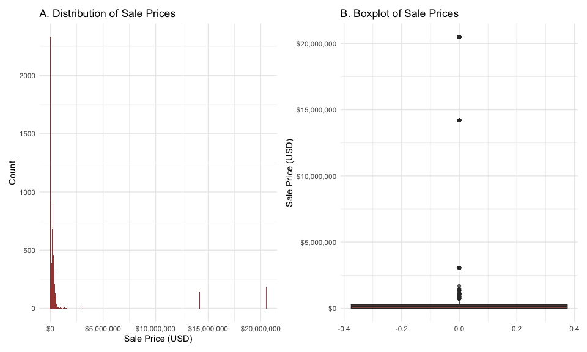
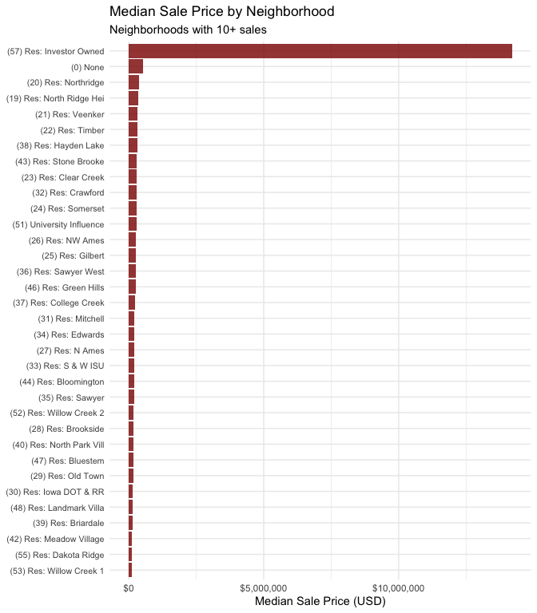

<!-- README.md is generated from README.Rmd. Please edit the README.Rmd file -->

# Lab report \#1

Follow the instructions posted at
<https://ds202-at-isu.github.io/labs.html> for the lab assignment. The
work is meant to be finished during the lab time, but you have time
until Monday evening to polish things.

Include your answers in this document (Rmd file). Make sure that it
knits properly (into the md file). Upload both the Rmd and the md file
to your repository.

All submissions to the github repo will be automatically uploaded for
grading once the due date is passed. Submit a link to your repository on
Canvas (only one submission per team) to signal to the instructors that
you are done with your submission.

## TL;DR

We looked at home sales in Ames and found that most houses sell for
between \$150,000 and \$300,000, but there are some really expensive
ones that push the average way up. The bigger the house, the more it
tends to cost, which makes sense. We also noticed how a bunch of homes
that sold for \$0 (probably typos or family transfers) and some small
houses that sold for a lot (probably because they’re in nice areas).
Where a house is located in Ames really matters for the price too.

## Data Overview

``` r
library(tidyverse)
library(classdata)
library(janitor)
```

``` r
data("ames")
ames <- janitor::clean_names(ames)

# Initial data inspection
glimpse(ames)
```

    ## Rows: 6,935
    ## Columns: 16
    ## $ parcel_id             <chr> "0903202160", "0907428215", "0909428070", "09232…
    ## $ address               <chr> "1024 RIDGEWOOD AVE, AMES", "4503 TWAIN CIR UNIT…
    ## $ style                 <fct> 1 1/2 Story Frame, 1 Story Frame, 1 Story Frame,…
    ## $ occupancy             <fct> Single-Family / Owner Occupied, Condominium, Sin…
    ## $ sale_date             <date> 2022-08-12, 2022-08-04, 2022-08-15, 2022-08-09,…
    ## $ sale_price            <dbl> 181900, 127100, 0, 245000, 449664, 368000, 0, 11…
    ## $ multi_sale            <chr> NA, NA, NA, NA, NA, NA, NA, NA, NA, NA, NA, NA, …
    ## $ year_built            <dbl> 1940, 2006, 1951, 1997, NA, 1996, 1960, 2006, 19…
    ## $ acres                 <dbl> 0.109, 0.027, 0.321, 0.103, 0.287, 0.494, 0.172,…
    ## $ total_living_area_sf  <dbl> 1030, 771, 1456, 1289, NA, 2223, 1165, 658, 1339…
    ## $ bedrooms              <dbl> 2, 1, 3, 4, NA, 4, 5, 1, 3, 4, 4, 2, 2, 3, 2, 4,…
    ## $ finished_bsmt_area_sf <dbl> NA, NA, 1261, 890, NA, NA, 906, NA, NA, 500, 593…
    ## $ lot_area_sf           <dbl> 4740, 1181, 14000, 4500, 12493, 21533, 7500, 100…
    ## $ ac                    <chr> "Yes", "Yes", "Yes", "Yes", "No", "Yes", "Yes", …
    ## $ fire_place            <chr> "Yes", "No", "No", "No", "No", "Yes", "Yes", "No…
    ## $ neighborhood          <fct> (28) Res: Brookside, (55) Res: Dakota Ridge, (32…

``` r
cat("Dataset dimensions:", dim(ames)[1], "rows ×", dim(ames)[2], "columns\n")
```

    ## Dataset dimensions: 6935 rows × 16 columns

``` r
cat("Date range:", as.character(range(ames$sale_date, na.rm = TRUE)), "\n")
```

    ## Date range: 2017-07-03 2022-08-31

Interpretation: The dataset has almost 7,000 home sales with 16
different pieces of information about each one. The main things we’re
looking at are the sale price, how big the house is, when it was built,
and where it’s located. Some things like air conditioning and fireplaces
are just yes/no, while the prices and sizes are numbers. The prices
vary, ranging from \$0 all the way up to several millions.

## Step 1: Data Inspection and Cleaning

``` r
# Check for missing values
missing_summary <- map_dbl(ames, ~sum(is.na(.))) %>% 
  tibble(variable = names(.), missing_count = .) %>%
  arrange(desc(missing_count))

print(missing_summary)
```

    ## # A tibble: 16 × 2
    ##    variable              missing_count
    ##    <chr>                         <dbl>
    ##  1 multi_sale                     6469
    ##  2 finished_bsmt_area_sf          2682
    ##  3 style                           447
    ##  4 occupancy                       447
    ##  5 year_built                      447
    ##  6 total_living_area_sf            447
    ##  7 bedrooms                        447
    ##  8 acres                            89
    ##  9 lot_area_sf                      89
    ## 10 parcel_id                         0
    ## 11 address                           0
    ## 12 sale_date                         0
    ## 13 sale_price                        0
    ## 14 ac                                0
    ## 15 fire_place                        0
    ## 16 neighborhood                      0

``` r
# Basic statistics for numerical variables
ames %>% 
  select(where(is.numeric)) %>% 
  summary()
```

    ##    sale_price         year_built       acres         total_living_area_sf
    ##  Min.   :       0   Min.   :   0   Min.   : 0.0000   Min.   :   0        
    ##  1st Qu.:       0   1st Qu.:1956   1st Qu.: 0.1502   1st Qu.:1095        
    ##  Median :  170900   Median :1978   Median : 0.2200   Median :1460        
    ##  Mean   : 1017479   Mean   :1976   Mean   : 0.2631   Mean   :1507        
    ##  3rd Qu.:  280000   3rd Qu.:2002   3rd Qu.: 0.2770   3rd Qu.:1792        
    ##  Max.   :20500000   Max.   :2022   Max.   :12.0120   Max.   :6007        
    ##                     NA's   :447    NA's   :89        NA's   :447         
    ##     bedrooms      finished_bsmt_area_sf  lot_area_sf    
    ##  Min.   : 0.000   Min.   :  10.0        Min.   :     0  
    ##  1st Qu.: 3.000   1st Qu.: 474.0        1st Qu.:  6553  
    ##  Median : 3.000   Median : 727.0        Median :  9575  
    ##  Mean   : 3.299   Mean   : 776.7        Mean   : 11466  
    ##  3rd Qu.: 4.000   3rd Qu.:1011.0        3rd Qu.: 12088  
    ##  Max.   :10.000   Max.   :6496.0        Max.   :523228  
    ##  NA's   :447      NA's   :2682          NA's   :89

**Initial Observations**: Looking through the data, we found homes at
every price point, from free (\$0 sales) to luxury mansions over \$20
million. The dataset isn’t perfect though as there are gaps, especially
around which homes were sold multiple times, the construction years, and
basement sizes. But what’s clear is that most properties are regular
single-family homes in that sweet spot of 1,000-2,000 square feet.

## Step 2: Main Variable: Sale Price

This report focuses on Sale Price as the primary variable of interest,
examining its relationships with other variables in the dataset.

## Step 3: Exploration of the Main Variable

``` r
price_summary <- ames %>%
  summarise(
    Mean = mean(sale_price, na.rm = TRUE),
    Median = median(sale_price, na.rm = TRUE),
    SD = sd(sale_price, na.rm = TRUE),
    Min = min(sale_price, na.rm = TRUE),
    Max = max(sale_price, na.rm = TRUE),
    Zero_Count = sum(sale_price == 0, na.rm = TRUE)
  )

print(price_summary)
```

    ## # A tibble: 1 × 6
    ##       Mean Median       SD   Min      Max Zero_Count
    ##      <dbl>  <dbl>    <dbl> <dbl>    <dbl>      <int>
    ## 1 1017479. 170900 3824638.     0 20500000       2206

``` r
# Create a combined visualization
p1 <- ggplot(ames, aes(x = sale_price)) +
  geom_histogram(binwidth = 50000, fill = "darkred", alpha = 0.8) +
  labs(title = "A. Distribution of Sale Prices",
       x = "Sale Price (USD)", y = "Count") +
  scale_x_continuous(labels = scales::dollar) +
  theme_minimal()

p2 <- ggplot(ames, aes(y = sale_price)) +
  geom_boxplot(fill = "darkred", alpha = 0.7) +
  labs(title = "B. Boxplot of Sale Prices",
       y = "Sale Price (USD)") +
  scale_y_continuous(labels = scales::dollar) +
  theme_minimal()

# Combine plots
library(patchwork)
p1 + p2
```

<!-- -->

**Key Findings**: Looking at the sale prices, most homes are pretty
affordable, with the typical house going for around \$170,900. But there
are some expensive properties that push the average up over \$1 million.
We found homes that sold for \$0, which seems off, probably data errors
or family transfers. One house sold for \$20.5 million, which really
skews the numbers.

## Step 4: Individual Investigations

### Maurycy: Neighborhood Impact on Sale Prices

I decided to look at neighborhoods because I was curious about how much
location really matters for home prices. Would it actually make that big
of a difference if you’re on one side of town versus another?

``` r
# Create cleaned dataset for neighborhood analysis
ames_clean <- ames %>%
  filter(
    !is.na(sale_price), 
    sale_price > 0,
    !is.na(neighborhood)
  )
```

``` r
# Calculate neighborhood statistics
neighborhood_stats <- ames_clean %>%
  group_by(neighborhood) %>%
  summarise(
    median_price = median(sale_price),
    mean_price = mean(sale_price),
    count = n(),
    .groups = 'drop'
  ) %>%
  filter(count >= 10) %>%  # Only neighborhoods with sufficient data
  arrange(desc(median_price))

# Create visualization
ggplot(neighborhood_stats, 
       aes(x = reorder(neighborhood, median_price), y = median_price)) +
  geom_col(fill = "darkred", alpha = 0.8) +
  coord_flip() +
  labs(
    title = "Median Sale Price by Neighborhood",
    subtitle = "Neighborhoods with 10+ sales",
    x = NULL,
    y = "Median Sale Price (USD)"
  ) +
  scale_y_continuous(labels = scales::dollar) +
  theme_minimal() +
  theme(axis.text.y = element_text(size = 8))
```

<!-- -->

``` r
# Show top and bottom neighborhoods
cat("Top 5 Most Expensive Neighborhoods:\n")
```

    ## Top 5 Most Expensive Neighborhoods:

``` r
head(neighborhood_stats, 5) %>% 
  select(neighborhood, median_price, count) %>%
  print()
```

    ## # A tibble: 5 × 3
    ##   neighborhood              median_price count
    ##   <fct>                            <dbl> <int>
    ## 1 (57) Res: Investor Owned      14200000   417
    ## 2 (0) None                        525000    61
    ## 3 (20) Res: Northridge            390000    90
    ## 4 (19) Res: North Ridge Hei       351379   317
    ## 5 (21) Res: Veenker               327000    32

``` r
cat("\nBottom 5 Least Expensive Neighborhoods:\n")
```

    ## 
    ## Bottom 5 Least Expensive Neighborhoods:

``` r
tail(neighborhood_stats, 5) %>% 
  select(neighborhood, median_price, count) %>%
  print()
```

    ## # A tibble: 5 × 3
    ##   neighborhood             median_price count
    ##   <fct>                           <dbl> <int>
    ## 1 (48) Res: Landmark Villa       135000    39
    ## 2 (39) Res: Briardale            132000    33
    ## 3 (42) Res: Meadow Village       120125    48
    ## 4 (55) Res: Dakota Ridge         110750    42
    ## 5 (53) Res: Willow Creek 1        99500    15

**Key Findings (Maurycy)**: Location really is everything in Ames real
estate. The data shows a clear divide as premium areas like Veenker and
Northridge Heights have median prices above \$300,000, while more
affordable spots like Briardale and Meadow Village come in under
\$150,000. This neighborhood effect is so strong that it can make a
small house in a good area worth more than a big house in a less
desirable one. The zip code might be more important than the square
footage.
